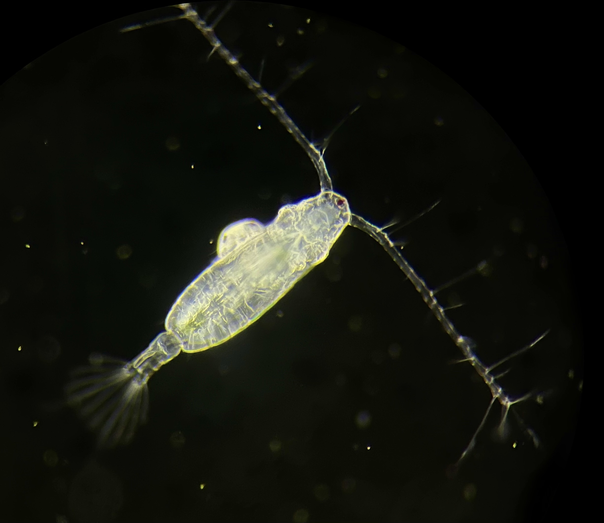

# Project Description

We collected a plankton sample from Key Largo Florida in late February 2023. Water temperature was 27 degrees C at the time of collection. While isolating *Acartia tonsa* individuals from this sample, we noticed that many females had larvae of a bopyrid isopod attached to their prosome. Given the important role *Acartia* copepods play in coastal systems, we wanted to test the hypothesis that infestation by bopyrid isopod larvae would reduce thermal limits in *Acartia tonsa*.

{width="400"}

# Methods

After collection, *Acartia tonsa* individuals were sorted from the bulk contents of the plankton tow. As copepods were being isolated, mature females that carried a late stage bopyrid isopod larva on their prosome were set aside, with an equal number of females not carrying an isopod. When 10 individuals had been collected (5 each, with and without isopods), critical thermal maxima (CTmax) were measured for the individuals using a custom heating device.

Briefly, individuals were isolated in 10 mL of filtered seawater in glass tubes. These tubes were held in a plexiglass water bath attached to a 20 L reservoir. The reservoir contained a 300 watt aquarium heater, which raised the temperature of the water in the reservoir at a fairly constant rate of 0.1-0.3 degrees C per minute. An aquarium pump in the reservoir flooded the water bath, which resulted in gradual warming of the water in the tubes. Copepods were continuously monitored until they ceased to respond to gentle stimulus (water movement caused by rotating the tube). Four separate CTmax assays were run (total n = 20 per treatment).

The CTmax values for the two groups (infected and non-infected) were compared using effect size estimates (mean difference). Confidence intervals were estimated using non-parametric bootstrapping. Since multiple replicate experiments were run and CTmax may have changed as time since collection increased, we also ran a linear mixed effects model, with CTmax modeled as a function of infection status with experimental replicate as a random effect.

```{r setup, include=T, message = F, warning = F, echo = F}
knitr::opts_chunk$set(
  echo = knitr::is_html_output(),
  fig.align = "center",
  fig.path = "../Figures/markdown/",
  dev = c("png", "pdf"),
  message = FALSE,
  warning = FALSE,
  collapse = T
)

theme_matt = function(base_size = 18,
                      dark_text = "grey20"){
  mid_text <-  monochromeR::generate_palette(dark_text, "go_lighter", n_colours = 5)[2]
  light_text <-  monochromeR::generate_palette(dark_text, "go_lighter", n_colours = 5)[3]
  
  ggpubr::theme_pubr(base_family="sans") %+replace% 
    theme(
      panel.background  = element_rect(fill="transparent", colour=NA), 
      plot.background = element_rect(fill="transparent", colour=NA), 
      legend.background = element_rect(fill="transparent", colour=NA),
      legend.key = element_rect(fill="transparent", colour=NA),
      text = element_text(colour = mid_text, lineheight = 1.1),
      title = element_text(size = base_size * 1.5,
                           colour = dark_text),
      axis.text = element_text(size = base_size,
                               colour = mid_text),
      axis.title = element_text(size = base_size * 1.2,
                                margin = margin(0, 8, 0, 0)),
      legend.text = element_text(size=base_size * 0.9),
      legend.title = element_text(size = base_size * 0.9, 
                                  face = "bold"),
      plot.margin = margin(0.25, 0.25, 0.25, 0.25,"cm")
    )
}
```

# Results

When examining the entire data set, there was no difference between CTmax values of copepods infested with isopods and the non-infested individuals. The estimated effect size (mean difference) was positive, but the confidence interval strongly overlapped zero.

```{r eff-size}
bop_eff = dabest(full_data,
                 x = bopyrid,
                 y = ctmax, 
                 idx = c("no", "yes"),
                 paired = F)

bop_diff = mean_diff(bop_eff)

plot(bop_diff, 
     rawplot.ylim = c(35.2, 37.6),
     rawplot.markersize = 4,
     rawplot.ylabel = "CTmax (degrees C)",
     palette = c("darkseagreen", "mediumpurple4"))
```

A linear mixed effect model also indicated no effect of bopyrid infestation. This model examined CTmax as a function of infestation status, with run number as a random effect.

```{r lme-model}
iso.model = nlme::lme(data = full_data, 
                      fixed = ctmax ~ bopyrid, random = ~1|run)
kable(car::Anova(iso.model))
```

Within the isopod infested treatment, however, there were three individuals with substantially lower thermal limits. When these points are removed, there is a small postive effect size estimate (bopyrid infested individuals had higher thermal limits than the controls).

```{r subset-eff-size}
subset = full_data %>%  
  filter(ctmax > 36)  

bop_eff = dabest(subset,
                 x = bopyrid,
                 y = ctmax, 
                 idx = c("no", "yes"),
                 paired = F)

bop_diff = mean_diff(bop_eff)

plot(bop_diff, 
     rawplot.ylim = c(35.2, 37.6),
     rawplot.markersize = 4,
     rawplot.ylabel = "CTmax (degrees C)",
     palette = c("darkseagreen", "mediumpurple4"))
```

With the three low values removed, the linear mixed effects model also indicates an effect of bopyrid infestation on CTmax.

```{r sub-lme-model}
sub_iso.model = nlme::lme(data = subset, 
                      fixed = ctmax ~ bopyrid, random = ~1|run)
kable(car::Anova(sub_iso.model))
```

## Meta-Analysis

Parasitism is widespread across taxa. In order to compare the observed effects with previous work, we conducted a small meta-analysis. Potential studies were obtained with a Web of Science search for "(CTmax OR "upper thermal limit" OR "thermal tolerance") AND parasit\*" on March 6th, 2023. This yielded 132 results, which were individually screened for inclusion in the meta-analysis. In order to be included, the study must have reported CTmax values for both infected and uninfected host animals. I used strict inclusion criteria to maximize comparability (excluding studies that measured thermal limits in time to knockdown, or percent survivorship after static temperature exposure, etc.). A total of five previously published studies met these criteria.

Mean thermal limits, standard deviations, and sample sizes were extracted from the study text or tables, or were manually calculated using the raw data. We then estimated standardized mean difference (SMD) and 95% confidence interval for each comparison between infected and non-infected animals. A negative SMD indicates that parasitism decreased thermal limits.

Below is the resulting forest plot, showing the SMD estimate for each comparison and the 95% confidence interval. The size of each point is proportional to the weight of each contrast. The diamond at the bottom of the plot summarizes the overall effect estimate. All previously published studies report a negative effect of parasitism on CTmax. It's worth noting that previous studies examined the effect of parasites on ultimate host CTmax, while *A. tonsa* is the intermediate host for this isopod. The different infection dynamics across parasite life stage might be expected to modify the effect of infection on host CTmax. A small number of other studies examining the effect of parasitism on other metrics of thermal tolerance also indicate an increase in thermal limits, so there is precedence for this effect. It would be interesting to re-check whether the reported positive effects also came from studies examining intermediate hosts.

```{r forest-plot}
library(metafor)

effects = escalc(measure = "SMD",
       m2i = uninfected_mean,
       sd2i = uninfected_error,
       n2i = uninfected_N,
       m1i = infected_mean,
       sd1i = infected_error, 
       n1i = infected_N,
       slab = id,
       data = meta_data)

res <- rma(yi, vi, data=effects)

forest(res,
       header="Study")
```

# Discussion

There was not a strong effect of bopyrid infestation on the thermal limit of *Acartia tonsa* females. If several notably lower thermal limits were excluded, thermal limits did appear to be about 0.3 degrees higher in the infested copepods than in the non-infested individuals. In either case (no difference or a small increase in thermal limits), this is contrary to our expectations that bopyrid infestation would reduce copepod thermal limits.

The pattern observed is strongly affected by whether we include or exclude three notably lower thermal limit measurements in the infested treatment. The attached bopyrids varied in size within this treatment. Assuming individuals are not switching hosts, this means that females with larger bopyrids are likely older than females with smaller bopyrids. The three individuals with particularly low thermal limits had larger bopyrids; the low thermal limits may therefore reflect the older age of these females. Unfortunately we lacked the required equipment to take photographs of these individuals and their bopyrids while CTmax measurements were being made. We are therefore unable to test for this correlation between larval length and host CTmax.

There are several potential explanations for an increase in thermal limits when parasitized. It's possible that HSP production is stimulated by infestation, thus priming copepods to respond to heat stress. It's commonly observed for infection to increase HSP production. Alternatively, previous work shows reduced respiration rates in *Acartia* infested by bopyrids. Reduced basal metabolisms may improve thermal tolerance. Reduced metabolism may also hinder the thermal stress response though if ATP limitation affects the production of HSPs.
