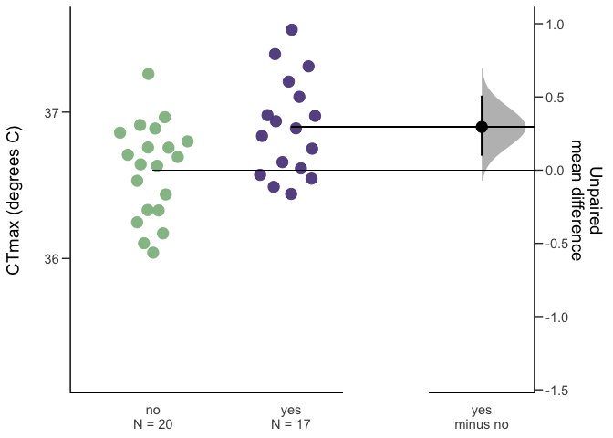

CTmax of bopyrid infested *Acartia tonsa*
================
2023-03-06

- <a href="#project-description" id="toc-project-description">Project
  Description</a>
- <a href="#methods" id="toc-methods">Methods</a>
- <a href="#results" id="toc-results">Results</a>
- <a href="#discussion" id="toc-discussion">Discussion</a>
- <a href="#other-things-to-add" id="toc-other-things-to-add">Other things
  to add</a>

# Project Description

We collected a plankton sample from Key Largo Florida in late February
2023. Water temperature was 27 degrees C at the time of collection.
While isolating *Acartia tonsa* individuals from this sample, we noticed
that many females had larvae of a bopyrid isopod attached to their
prosome. Given the important role *Acartia* copepods play in coastal
systems, we wanted to test the hypothesis that infestation by bopyrid
isopod larvae would reduce thermal limits in *Acartia tonsa*.

# Methods

After collection, *Acartia tonsa* individuals were sorted from the bulk
contents of the plankton tow. As copepods were being isolated, mature
females that carried a late stage bopyrid isopod larva on their prosome
were set aside, with an equal number of females not carrying an isopod.
When 10 individuals had been collected (5 each, with and without
isopods), critical thermal maxima (CTmax) were measured for the
individuals using a custom heating device.

Briefly, individuals were isolated in 10 mL of filtered seawater in
glass tubes. These tubes were held in a plexiglass water bath, held
above a 20 L reservoir. The reservoir contained a 300 watt aquarium
heater, which raised the temperature of the water in the reservoir at a
fairly constant rate of 0.1-0.3 degrees C per minute. An aquarium pump
in the reservoir flooded the water bath, which resulted in gradual
warming of the water in the tubes. Copepods were continuously monitored
until they ceased to respond to gentle stimulus (water movement caused
by rotating the tube).

The CTmax values for the two groups (infected and non-infected) were
compared using effect size estimates (mean difference). Confidence
intervals were estimated using non-parametric bootstrapping. Since
multiple replicate experiments were run and CTmax may have changed as
time since collection increased, we also ran a linear mixed effects
model, with CTmax modeled as a function of infection status with
experimental replicate as a random effect.

# Results

There was no difference between CTmax values of copepods infested with
isopods and the non-infested individuals. The estimated effect size
(mean difference) was positive, but the confidence interval strongly
overlapped zero.

``` r
bop_eff = dabest(full_data,
                 x = bopyrid,
                 y = ctmax, 
                 idx = c("no", "yes"),
                 paired = F)

bop_diff = mean_diff(bop_eff)

plot(bop_diff)
```


A linear mixed effect model also indicated no effect of bopyrid
infestation. This model examined CTmax as a function of infestation
status, with run number as a random effect.

``` r
iso.model = nlme::lme(data = full_data, 
                      fixed = ctmax ~ bopyrid, random = ~1|run)
kable(car::Anova(iso.model))
```

|         |     Chisq |  Df | Pr(\>Chisq) |
|:--------|----------:|----:|------------:|
| bopyrid | 0.5071016 |   1 |   0.4763963 |

One interesting aspect of this data is that while bopyrid infestation
did not result in changes in the mean CTmax value, there was an apparent
increase in the variability of thermal limits between groups. Within the
isopod infested individuals, there were three substantially lower
thermal limits. When these are removed, there is a small effect size
estimate (bopyrid infested individuals had higher thermal limits than
the controls).

``` r
subset = full_data %>%  
  filter(ctmax > 36)  

bop_eff = dabest(subset,
                 x = bopyrid,
                 y = ctmax, 
                 idx = c("no", "yes"),
                 paired = F)

bop_diff = mean_diff(bop_eff)

plot(bop_diff)
```



With the three low values removed, a linear mixed effects model also
indicates an effect of bopyrid infestation on CTmax.

``` r
sub_iso.model = nlme::lme(data = subset, 
                      fixed = ctmax ~ bopyrid, random = ~1|run)
kable(car::Anova(sub_iso.model))
```

|         |   Chisq |  Df | Pr(\>Chisq) |
|:--------|--------:|----:|------------:|
| bopyrid | 7.44407 |   1 |   0.0063646 |

# Discussion

There was no effect of bopyrid infestation on the thermal limit of
*Acartia tonsa* females. If several notably lower thermal limits were
excluded, however, thermal limits appear to be higher in the infested
copepods than in the non-infested individuals. In both cases (no
difference or a small increase in thermal limits), this is contrary to
our expectations that bopyrid infestation would reduce copepod thermal
limits.

The pattern observed is strongly affected by whether we include or
exclude three notably lower thermal limit measurements in the infested
treatment. The attached bopyrids varied in size within this treatment.
Assuming individuals are not switching hosts, this means that females
with larger bopyrids are likely older than females with smaller
bopyrids. The three individuals with particularly low thermal limits had
larger bopyrids; the low thermal limits may therefore reflect the older
age of these females. However, unfortunately without proper equipment we
were unable to take photographs of these individuals and their bopyrids
in order to measure lengths.

There are several potential explanations for an increase in thermal
limits when parasitized. It’s possible that HSP production is stimulated
by infestation, thus priming copepods to respond to heat stress.
Alternatively, previous work shows reduced respiration rates in
*Acartia* infested by bopyrids. Reduced basal metabolisms may improve
thermal tolerance. Reduced metabolism may also hinder the thermal stress
response though if ATP limitation affects the production of HSPs.

# Other things to add

Depending on the number of similar studies, it might be possible to add
a small meta-analysis on the effects of parasitism on CTmax.
