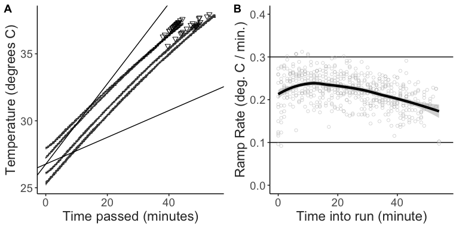

Figures for: Parasitism does not reduce thermal limits in the
intermediate host of a Bopyrid isopod
================
2023-03-10

- <a href="#main-figures" id="toc-main-figures">Main Figures</a>
- <a href="#supplementary-figures"
  id="toc-supplementary-figures">Supplementary Figures</a>

# Main Figures

``` r
bop_eff = dabest(full_data,
                 x = bopyrid,
                 y = ctmax, 
                 idx = c("no", "yes"),
                 paired = F)

bop_diff = mean_diff(bop_eff)

full_plot = plot(bop_diff, 
     rawplot.ylim = c(35.2, 37.6),
     rawplot.markersize = 4,
     rawplot.ylabel = "CTmax (°C)",
     palette = c("darkseagreen", "mediumpurple4"))

subset = full_data %>%  
  filter(ctmax > 36)  

sub_bop_eff = dabest(subset,
                 x = bopyrid,
                 y = ctmax, 
                 idx = c("no", "yes"),
                 paired = F)

sub_bop_diff = mean_diff(sub_bop_eff)

sub_plot = plot(sub_bop_diff, 
     rawplot.ylim = c(35.2, 37.6),
     rawplot.markersize = 4,
     rawplot.ylabel = "CTmax (°C)",
     palette = c("darkseagreen", "mediumpurple4"))

ggpubr::ggarrange(full_plot, sub_plot)
```


``` r
iso.model = nlme::lme(data = full_data, 
                      fixed = ctmax ~ bopyrid, random = ~1|run)
kable(car::Anova(iso.model))
```

|         |     Chisq |  Df | Pr(\>Chisq) |
|:--------|----------:|----:|------------:|
| bopyrid | 0.5071016 |   1 |   0.4763963 |

``` r
sub_iso.model = nlme::lme(data = subset, 
                      fixed = ctmax ~ bopyrid, random = ~1|run)
kable(car::Anova(sub_iso.model))
```

|         |   Chisq |  Df | Pr(\>Chisq) |
|:--------|--------:|----:|------------:|
| bopyrid | 7.44407 |   1 |   0.0063646 |

``` r
library(metafor)

effects = escalc(measure = "SMD",
       m2i = uninfected_mean,
       sd2i = uninfected_error,
       n2i = uninfected_N,
       m1i = infected_mean,
       sd1i = infected_error, 
       n1i = infected_N,
       slab = id,
       data = meta_data)

res <- rma(yi, vi, data=effects)

forest(res,
       header="Study")
```


# Supplementary Figures

``` r
temp_trace = ggplot(filter(temp_record, minute_passed < max(full_data$time) + 2), 
       aes(x = minute_passed, y = temp_C, group = factor(run))) + 
  geom_abline(slope = 0.3, 
              intercept = mean(temp_record[temp_record$minute_interval == 0, 8])) + 
  geom_abline(slope = 0.1, 
              intercept = mean(temp_record[temp_record$minute_interval == 0, 8])) + 
  geom_line(linewidth = 0.2, alpha = 0.8) + 
  geom_point(data = full_data, 
             aes(x = time, y = ctmax + 0.4),
             size = 2,
             shape = 25) +
  labs(x = "Time passed (minutes)",
       y = "Temperature (degrees C)",
       fill = "Trial Number") + 
  guides(colour = "none") + 
  theme_matt(base_size = 14) + 
  theme(legend.position = "right")


ramp_rates = ggplot(ramp_record, aes(x = minute_interval, y = ramp_per_minute)) + 
  geom_hline(yintercept = 0.3) + 
  geom_hline(yintercept = 0.1) + 
  geom_point(alpha = 0.5, colour = "grey") + 
  geom_smooth(linewidth = 2, colour = "black") + 
  ylim(0,0.4) + 
  labs(y = "Ramp Rate (deg. C / min.)",
       x = "Time into run (minute)") + 
  theme_matt(base_size = 14)

ggpubr::ggarrange(temp_trace, ramp_rates, labels = "AUTO")
```


